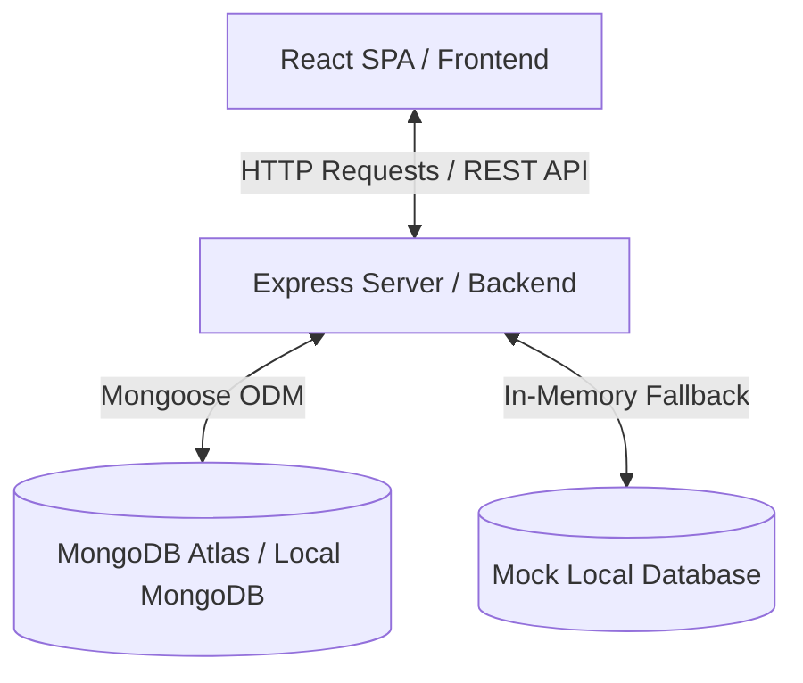

# TaskFlow ⚡️

[](https://vite.dev/)
[](https://react.dev/)
[](https://tailwindcss.com/)
[](https://nodejs.org/)
[](https://expressjs.com/)
[](https://www.mongodb.com/)

A modern, responsive, and feature-rich full-stack To-Do list application designed to streamline daily tasks, manage productivity, and organize schedules seamlessly.

---

## 1. Project Overview

**TaskFlow** is a MERN-stack application that provides users with an intuitive interface to manage, filter, and track their tasks. Designed with a sleek dark-themed/modern UI and smooth micro-animations, it offers seamless task organization with categories, prioritization, subtask tracking, and due dates. 

The application uses **React** on the frontend built with **Vite** for lightning-fast performance, styled with **Tailwind CSS**. The backend is powered by **Node.js** and **Express.js** with **MongoDB** (via **Mongoose**) serving as the persistent database layer, complete with a fallback mock database for zero-config local development.

---

## 2. Features

- 📝 **Create, Read, Update, Delete (CRUD)**: Manage tasks seamlessly with full database persistence.
- 🚦 **Priority Levels**: Set task priorities (`Low`, `Medium`, `High`) with clear visual indicators.
- 🏷️ **Task Categories**: Classify tasks (e.g., *Work*, *Personal*, *Study*) to keep your workspace structured.
- 🕒 **Due Dates & Times**: Assign start/end dates and times to keep track of schedules.
- 🌿 **Subtask Checklists**: Break down larger tasks into smaller action items.
- 🔍 **Search & Filters**: Instantly find tasks by keywords or filter by Category, Priority, and Status.
- 📱 **Fully Responsive**: Optimized for desktop, tablet, and mobile screens.
- 🔄 **Stateful Status Dashboard**: Track metrics showing Total, Completed, Pending, and Upcoming tasks.

---

## 3. Tech Stack

### Frontend
- **React.js**: Library for building interactive user interfaces.
- **Vite**: Ultra-fast next-generation frontend build tooling.
- **Tailwind CSS**: Utility-first CSS framework for styling.
- **Axios**: Promise-based HTTP client for API requests.
- **Lucide React**: Sleek and modern icon library.

### Backend
- **Node.js**: Cross-platform JavaScript runtime environment.
- **Express.js**: Fast, minimalist web framework for routing.
- **Mongoose**: Elegant MongoDB object modeling for Node.js.
- **Cors**: Middleware to enable Cross-Origin Resource Sharing.
- **Dotenv**: Environment variable configuration manager.

### Database
- **MongoDB**: Document-oriented NoSQL database.

---

## 4. Project Architecture

TaskFlow is designed with a decoupled client-server architecture:



* **Client Layer**: The Vite-React frontend manages state locally. API calls are consolidated inside a service wrapper using Axios.
* **Server Layer**: The Express server exposes RESTful endpoints, parses incoming JSON payloads, handles CORS, and performs validation.
* **Data Layer**: The backend implements a hybrid persistence pattern. If MongoDB is online (via `MONGO_URI`), Mongoose schemas store the data. If offline, the server gracefully falls back to an in-memory mock database for instant local evaluation.

---

## 5. Folder Structure

```text
ToList/
├── public/                 # Static assets for the frontend
├── src/                    # React frontend codebase
│   ├── assets/             # SVGs and images
│   ├── components/         # Reusable UI components (Navbar, cards, etc.)
│   ├── pages/              # Main view screens (Dashboard, AllTasks, task creation)
│   ├── services/           # Axios API configuration & services
│   ├── App.jsx             # Main Application root
│   └── main.jsx            # React entry point
├── server/                 # Express backend codebase
│   ├── config/             # DB connectivity and mock database fallback configuration
│   ├── controllers/        # Request handling and business logic
│   ├── models/             # Mongoose schemas (Task models)
│   ├── routes/             # Express API endpoints
│   ├── package.json        # Backend dependencies & scripts
│   └── server.js           # Server entry point
├── package.json            # Frontend dependencies & build configurations
└── tailwind.config.js      # Tailwind styling configuration
```

---

## 6. Installation Guide

Ensure you have [Node.js](https://nodejs.org/) (v16+) and [MongoDB](https://www.mongodb.com/) installed on your machine.

Clone the repository to your local directory:
```bash
git clone https://github.com/TEJA-100/ToDoList.git
cd ToDoList
```

---

## 7. Frontend Setup Commands

Install the frontend dependencies and launch the dev environment:
```bash
# From the root directory:
npm install
npm run dev
```
The React development server will start on `http://localhost:5173`.

---

## 8. Backend Setup Commands

Initialize dependencies for the Express backend and launch the server:
```bash
# Navigate to the server folder:
cd server
npm install
npm start
```
The server will start on `http://localhost:5000`.

---

## 9. Required NPM Packages

Here are the primary packages required for each folder, along with the command to install them.

### Root / Frontend Packages
```bash
# Install root/frontend packages (run from the root directory)
npm install react react-dom axios lucide-react
npm install -D vite tailwindcss postcss autoprefixer
```

### Backend Packages
```bash
# Install backend packages (run from the server directory)
cd server
npm install express mongoose cors dotenv
```

---

## 10. Environment Variables

Create a `.env` file inside the `server/` directory to customize your server port and database connection.

### `server/.env` Example:
```env
PORT=5000
MONGO_URI=mongodb+srv://<username>:<password>@cluster0.xxxx.mongodb.net/taskflow?retryWrites=true&w=majority
```
*Note: If no `MONGO_URI` is specified, the application automatically boots up using the local in-memory database fallback (`server/config/mockDb.js`).*

---

## 11. Running the Application

To run both client and server locally:

1. **Start the Backend**:
   ```bash
   cd server
   npm start
   ```
2. **Start the Frontend**:
   ```bash
   # In a new terminal tab at the root directory:
   npm run dev
   ```
3. Open your browser and navigate to `http://localhost:5173`.

---

## 12. API Endpoints

All backend routes are prefixed with `/api`.

| HTTP Method | Endpoint | Description |
|---|---|---|
| **GET** | `/api/tasks` | Retrieves all tasks |
| **GET** | `/api/tasks/completed` | Retrieves all completed tasks |
| **GET** | `/api/tasks/pending` | Retrieves all pending tasks |
| **GET** | `/api/tasks/upcoming` | Retrieves all upcoming tasks |
| **GET** | `/api/tasks/:id` | Retrieves a specific task details by ID |
| **POST** | `/api/tasks` | Creates a new task |
| **PUT** | `/api/tasks/:id` | Updates an existing task by ID |
| **DELETE** | `/api/tasks/:id` | Deletes a task by ID |

---

## 13. Database Schema Overview

The MongoDB database stores tasks using the following structured Mongoose schemas:

### Task Schema:
```javascript
{
  title: { type: String, required: true, trim: true },
  description: { type: String, trim: true },
  priority: { type: String, enum: ['High', 'Medium', 'Low'], default: 'Medium' },
  status: { type: String, enum: ['Pending', 'Completed', 'Upcoming'], default: 'Pending' },
  startDate: { type: Date, required: true },
  endDate: { type: Date, required: true },
  startTime: { type: String, required: true },
  endTime: { type: String, required: true },
  category: { type: String, default: 'General' },
  subtasks: [
    {
      title: { type: String, required: true },
      completed: { type: Boolean, default: false }
    }
  ]
}
```

---

## 14. Screenshots Section

Add visual previews of your deployment:

| Dashboard View | Search and Filters |
| :---: | :---: |
|  | *Add screenshot links here* |

---

## 15. Future Enhancements

- 🔒 **User Authentication**: Add user signup, login, and JWT-based session security.
- 🔔 **Push Notifications**: Receive alerts in-app or via email when task deadlines are approaching.
- 📊 **Analytics Dashboard**: Add charts and graphs showing weekly/monthly task completion progress.
- 📅 **Calendar View**: Integrate a fully interactive grid calendar (like FullCalendar) for planning.

---

## 16. Contributing Guidelines

Contributions are what make the open-source community such an amazing place to learn, inspire, and create. Any contributions you make are **greatly appreciated**.

1. Fork the Project.
2. Create your Feature Branch (`git checkout -b feature/AmazingFeature`).
3. Commit your Changes (`git commit -m 'Add some AmazingFeature'`).
4. Push to the Branch (`git push origin feature/AmazingFeature`).
5. Open a Pull Request.

---

## 17. License

Distributed under the MIT License. See `LICENSE` for more information.

---

## 18. Author Information

Created with ❤️ by:
* **Teja**
* GitHub: [@TEJA-100](https://github.com/TEJA-100)
